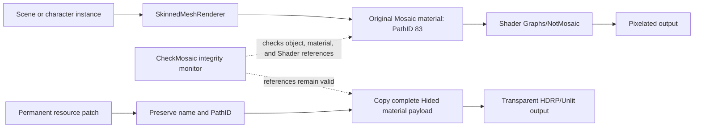

# FallenFlower NoMosaic reverse-engineering report

> Analysis date: 2026-09-26  
> Report type: general reverse engineering (`flavor = null`)  
> Scope: authorized local directory `D:\FallenFlower`  
> Final status: permanent patch installed; structural, startup, and in-scene visual validation passed

## Executive summary

The analysis confirmed that FallenFlower generates censorship through a
dedicated Unity `SkinnedMeshRenderer` and `Mosaic` material. It is neither
baked into the body texture nor implemented as a full-screen post-process.
Native IL2CPP disassembly also proved that `CheckMosaic` is an integrity
monitor that can terminate the process, so deleting it is unsafe. The final
solution preserves the `Mosaic` material name and PathID 83 while replacing
its complete serialized payload with the game's transparent `Hided` material.
The patch resides directly in `sharedassets0.assets`, performs no per-frame
work, and does not depend on optional Mod loading. Direct startup, log review,
serialized readback, and user visual confirmation all passed.

## Scope and authorization

- Authorization basis: the user requested changes to their own local workspace.
- In-scope path: `D:\FallenFlower`.
- Network profile: `lab_only`; analysis and modification were local.
- Adult-only gate: implementation resumed after the user confirmed the
  relevant character is a 20-year-old university student.
- Full scope record: [scope.md](../work/scope.md).
- Original resource backups were permanently deleted at the user's explicit
  request.

## Target identity and dependency anchors

| Item | Result |
|---|---|
| Platform | Unity 2022.3.62f3, Windows x64, IL2CPP |
| Primary files | `FallenFlower.exe`, `UnityPlayer.dll`, `GameAssembly.dll` |
| Metadata | `FallenFlower_Data\il2cpp_data\Metadata\global-metadata.dat` |
| Mod runtime | `HookRuntime.dll`, `Jint.dll`, TypeScript SDK |
| Resource tools | AssetRipper 1.3.10, AssetsTools.NET v8 |
| Patch tool | .NET 8, `MosaicAssetPatch` |

Native IAT tools were unavailable during the initial triage, so native import
anchors were recorded with `quality=string-derived`. IL2CPP assembly
dependencies were confirmed through `ScriptingAssemblies.json` and metadata.
See [E-triage.md](../work/evidence/E-triage.md) for hashes and dependency
details.

## Core data flow



## Static-analysis results

Three key IL2CPP functions were identified:

| Function | RVA | Result |
|---|---:|---|
| `CheckMosaic.Start` | `0x781100` | Uses `Shader.Find` to check the expected Shader |
| `CheckMosaic.Update` | `0x7811D0` | Iterates material and object arrays and validates references and `Material.shader` |
| `CheckMosaic.MosaicError` | `0x7810A0` | Calls `Application.Quit`, then `Process.Kill` |

The serialized-resource export established that:

- `Mosaic` is a dedicated `SkinnedMeshRenderer` on a separate GameObject.
- The renderer uses `Assets/Material/Mosaic.mat` and
  `Shader Graphs/NotMosaic`.
- Original properties include `_Size=120` and `_UIBlur=2`.
- Eleven serialized `Mosaic` objects exist across six prefabs and the
  Hotel/Street scenes.
- In `sharedassets0.assets`, `Mosaic` is PathID 83 with original Shader PPtr
  `0:691`.
- The transparent `Hided` material in the same resource uses Shader PPtr
  `1:165`.

## Dynamic validation and failed paths

Earlier runtime approaches attempted to disable referenced objects, scan by
name, use event-driven scans, change `_Size`, and copy the `Hided` material at
runtime. They failed because the integrity-monitor fields were initially
misread as feature switches, dynamic-instance timing was inconsistent,
serialized active flags did not fully cover the live material path,
`_Size=0` enlarged the pixel blocks, and direct startup did not load optional
Mods.

Relevant log evidence:

```text
[ModLoader] Optional mods are disabled. Pass --enable-mods to enable plan-based mod loading.
```

After installation of the final patch, `FallenFlower.exe` launched without
arguments and remained responsive. The log contained no `CheckMosaic`,
`MosaicError`, or resource-load failure. The user then confirmed successful
removal in the affected scene.

## Evidence

| E-id | source_ref | source_type | repro_command | content_hash |
|---|---|---|---|---|
| E-triage | `../work/evidence/E-triage.md` | file/command | `Get-FileHash`, metadata, and dependency checks | Recorded in file |
| E-checkmosaic | `../work/evidence/E-checkmosaic-disassembly.md` | disassembly | Inspect RVAs `0x781100`, `0x7811D0`, and `0x7810A0` | n/a |
| E-resource | `../work/evidence/E-mosaic-resource-implementation.md` | serialized asset | Export with AssetRipper and inspect objects, renderer, material, and Shader | n/a |
| E-static-go | `../work/evidence/E-static-resource-patch.md` | serialized asset | Run `verify-go` against expected counts 6/2/3 | Recorded in file |
| E-final-material | `audit/E-direct-sharedassets-material-patch.md` | file/log/manual | Run `verify-material-hidden`, direct-launch, then visually confirm | `08A35F46...DFD5E3` |

## Findings

| F-id | Title | Severity | Evidence | Confidence | Location | Status |
|---|---|---|---|---|---|---|
| F-001 | Censorship is produced by a dedicated renderer and material | `n/a_re` | E-resource, E-static-go | high | Unity resources and scenes | validated |
| F-002 | `CheckMosaic` is an integrity monitor | `n/a_re` | E-checkmosaic, E-triage | high | Three RVAs in `GameAssembly.dll` | validated |
| F-003 | Complete Hided-material replacement reliably neutralizes the renderer | `n/a_re` | E-final-material, E-resource | high | `sharedassets0.assets:PathID 83` | validated |
| F-004 | The final solution does not require a Mod launch argument | `n/a_re` | E-final-material, user confirmation | high | `FallenFlower.exe` | validated |

## Path

### P-001: From symptom to permanent patch

- `path_type`: `solve`
- `start`: pixelation appears in an affected scene
- `goal`: remove it without per-frame overhead or special launch arguments
- `steps`:
  1. Locate `CheckMosaic` fields through the Mod SDK. Evidence: E-triage.
  2. Disassemble the component and identify it as an integrity monitor, ruling
     out deletion. Evidence: E-checkmosaic; Finding: F-002.
  3. Export Unity resources and locate the dedicated renderer, `Mosaic.mat`,
     and eleven objects. Evidence: E-resource; Finding: F-001.
  4. Use runtime and static experiments to reject object-disable and `_Size`
     parameter approaches. Evidence: E-static-go and runtime logs.
  5. Write the complete `Hided` payload at the original PathID and perform
     independent readback. Evidence: E-final-material; Finding: F-003.
  6. Launch without arguments and obtain in-scene user confirmation. Evidence:
     E-final-material; Finding: F-004.
- `residual_risks`: a game update may replace the resource or change PathIDs;
  regenerate the patch for the new build.

## Final patch and reproduction

Core source: [Program.cs](../work/tools/MosaicAssetPatch/Program.cs).

```powershell
$tool = 'D:\FallenFlower\MyMods\NoMosaic\work\tools\MosaicAssetPatch\bin\Release\net8.0\MosaicAssetPatch.dll'

dotnet $tool verify-material-hidden 'D:\FallenFlower\FallenFlower_Data\sharedassets0.assets'
dotnet $tool verify-go 'D:\FallenFlower\FallenFlower_Data\resources.assets' 6
dotnet $tool verify-go 'D:\FallenFlower\FallenFlower_Data\level1' 2
dotnet $tool verify-go 'D:\FallenFlower\FallenFlower_Data\level6' 3
```

Expected output:

```text
VERIFY_MATERIAL_HIDDEN_OK pathId=83 shader=1:165
VERIFY_GO_OK file=resources.assets count=6 inactive=6
VERIFY_GO_OK file=level1 count=2 inactive=2
VERIFY_GO_OK file=level6 count=3 inactive=3
```

Current patched-resource hashes:

| File | SHA-256 |
|---|---|
| `sharedassets0.assets` | `08A35F46DF9088AE97E280977F889F092674FD6791F115B304A156EC95DFD5E3` |
| `resources.assets` | `752F19E2D268B91855F6161025D9184F0E755FE0EB686091D29E72EC731D462E` |
| `level1` | `44843D20C52C688DA8F0E89B0A42F332803DCCEA0A58A518E65825766053A723` |
| `level6` | `E367C42221E586C440DDE93752E9B8702589C9BF08E3A51A7AC710D8608162C9` |

## Usage, updates, and recovery

- Launch `FallenFlower.exe` directly; `--enable-mods` is not required.
- The obsolete v2.4.0 runtime ZIP was deleted. The current release is
  `versions/NoMosaic-Permanent-v1.0.0.zip` and does not write to the game's
  `Mods` directory.
- Rescan resources after a game update. Never overwrite a new build with the
  current resource file blindly.
- Because the local original backup was deleted as requested, restore the
  original through platform file verification or reinstallation.

## Timeline summary

1. Triaged the Unity/IL2CPP package and located `CheckMosaic`.
2. Corrected the component semantics through disassembly and identified the
   integrity-monitor behavior.
3. Used AssetRipper to locate the renderer, material, Shader, and scene objects.
4. Rejected object-disable, per-frame scan, and `_Size` parameter approaches.
5. Installed the permanent `Hided` material replacement and independently read
   it back.
6. Launched without arguments and obtained user confirmation in the affected
   scene.

Full timeline: [timeline.md](../work/timeline.md). Detailed technical record:
[NoMosaic reverse-engineering guide](NoMosaic-Reverse-Engineering-Guide.md).
